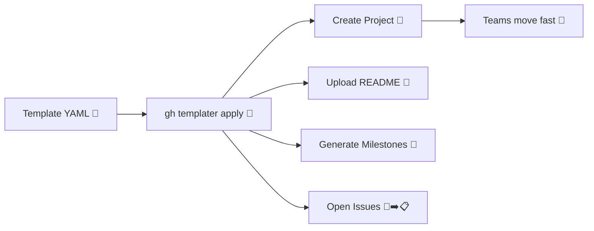

# gh-templater ✨🛠️

> A GitHub CLI extension that turns YAML project templates into fully-provisioned GitHub Projects with milestones and issues.

## 🌟 Why
Modern teams repeat the same bootstrap steps for every new initiative. `gh-templater` lets you codify those steps as YAML so
anyone can spin up a ready-to-track project with a single command—no copy/paste required.



## 🚀 Quickstart

1. [Install GitHub CLI](https://docs.github.com/en/github-cli/github-cli/quickstart) and ensure you are authenticated (`gh auth login`).
2. Install the extension:
   ```bash
   gh extension install <your-org>/gh-templater
   ```
3. Pick a template (see `templates/` for examples) and apply it:
   ```bash
   gh templater apply \
     --org your-org \
     --project "Platform Readiness" \
     --issues-repo your-org/roadmap \
     --template templates/backend-grpc.yaml
   ```

Add `--sections` to run a subset of the workflow (choose from `project`, `labels`, `milestones`, `issues`). For example, to only ensure labels and issues run:

```bash
gh templater apply \
  --org your-org \
  --project "Existing Project" \
  --issues-repo your-org/roadmap \
  --template templates/backend-grpc.yaml \
  --sections labels,issues
```

The command will:
- 🚧 Create or update a GitHub Project (Projects v2) under the org you specify (when `project` is selected).
- 🏷️ Ensure repo labels match the template (when `labels` is selected).
- 🎯 Create milestones and issues in the target repository (when `milestones`/`issues` are selected).
- 📘 Apply the template README content to the project.
- 📌 Add each issue to the new project automatically when both `project` and `issues` are selected.

## 🤖 Automate with GitHub Actions

Trigger the included workflow to stand up a project without touching your terminal:

1. Create a fine-scoped PAT (Projects, Issues, and Repo access) and add it as the repository secret `GH_TEMPLATER_TOKEN`.
2. Open **Actions → Apply Project Template → Run workflow**.
3. Provide the organization, issues repo (`owner/repo`), project name, and template filename (relative to `templates/`).

The workflow exports the secret as both `GH_TOKEN` and `GITHUB_TOKEN`, so the `gh` CLI inside the runner can authenticate and run `gh templater apply ...` for you. You can also dispatch it via CLI:

```bash
gh workflow run Apply-Project-Template \
  -f org=your-org \
  -f repo=your-org/roadmap \
  -f project-name="Platform Readiness" \
  -f template-name=backend-grpc.yaml
```

> ℹ️ Secrets are resolved at runtime—no PAT ever appears in the workflow inputs or logs unless echoed explicitly.

## 🧾 Template format
Templates are YAML files that describe the project README, labels, custom project fields, milestones, and issues. A minimal example:

```yaml
name: Reliability Sprint
readme: |
  # Reliability Sprint
  Tracking our availability goals.
labels:
  - name: spec
    color: 9B59B6
    description: Spec-driven work
fields:
  - name: Spec State
    data_type: SINGLE_SELECT
    description: Spec kit workflow
    options:
      - name: Draft
        color: YELLOW
milestones:
  - title: Hardening
    description: Improve error budgets
issues:
  - title: Audit error budget
    body: Collect SLI data for the past 90 days
    labels: [reliability]
    milestone: Hardening
    fields:
      Spec State: Draft
      Spec Link: docs/roadmap/reliability.md
```

See [`docs/templates.md`](docs/templates.md) for the full schema, including how to scope runs with `--sections`. For a full Shape Up project bootstrap, try `templates/shapeup-launchpad.yaml` which mirrors the legacy `bootstrap-project.sh` content.

## 🧰 Commands

- `gh templater apply`: Apply a YAML template to an organization and issues repository.

Run `gh templater apply --help` to see the complete flag list.

## 🛠️ Development

This extension follows the [GitHub CLI extension](https://docs.github.com/en/github-cli/github-cli/creating-github-cli-extensions) model.

### ✅ Requirements
- Go 1.21+
- (Optional) [`golangci-lint`](https://golangci-lint.run/usage/install/) for richer linting

### 🧪 Useful scripts

The repository includes a `Makefile` for a fast feedback loop:

```bash
make fmt   # gofmt all Go files
make lint  # run golangci-lint if available, otherwise go vet
make test  # run unit tests
make build # compile the gh-templater binary
make help  # list targets with descriptions
```

### 🏃 Local execution

Clone the repo and use `gh` to run the local extension without installing globally:

```bash
gh extension exec ./gh-templater templater apply --org my-org --project "My Project" --issues-repo my-org/roadmap --template templates/backend-grpc.yaml
```

## 💡 Inspiration
- [`gh-projects`](https://github.com/github/gh-projects) for CLI ergonomics
- [`gk-cli`](https://github.com/gitkraken/gk-cli) for documentation tone and structure

## 🤝 Contributing
- Open an issue or PR with your proposal.
- Add tests for new behaviors.
- Keep templates and docs in sync so users can move from README to execution quickly.
