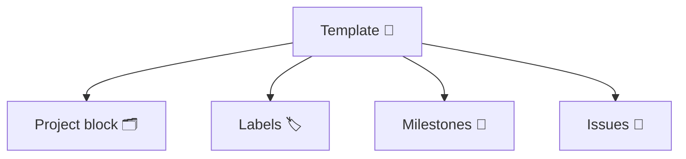

# Template schema

Templates describe everything needed to stand up a GitHub Project and its execution backlog. Each file is a YAML document
with optional sections for `project`, `labels`, `milestones`, and `issues`.

The built-in parser supports the YAML constructs used in the example files (maps, lists, and `|` block scalars). Keep
indentation consistent—two spaces for nested fields works best.

## Fields

| Field | Type | Required | Description |
| --- | --- | --- | --- |
| `name` | string | No | Human-friendly template name. |
| `project` | object | No | Contains `readme` (Markdown applied to the project README) and optional `fields` describing Project V2 custom fields. Provide `name`, `data_type` (`SINGLE_SELECT`, `TEXT`, `NUMBER`, `DATE`, etc.), optional `description`, and for select fields supply `options` (each with `name`, optional `color`, `description`). When template issues specify a `fields` map, gh-templater ensures those project fields (and any missing single-select options) exist before applying the desired values. Templates without a `project` block skip project creation automatically. The same structure powers `gh templater delete`, so fields are only removed when the template requests it. |
| `labels` | list | No | Repo labels to ensure. Each entry supports `name`, optional `color`, and optional `description`. |
| `milestones` | list | No | Milestones created in the issues repository. Each milestone includes `title`, optional `description`, and optional ISO8601 `due_on`. |
| `issues` | list | No | Issues created in the issues repository. Each issue includes `title`, `body`, optional `labels`, optional `milestone` (must match a milestone title), optional `assignees`, optional `fields` (map of project field name to value), and optional `doc` context. |

## Authoring tips
- Keep `project.readme` focused on the project mission, milestones, and definition of done.
- Use `labels` to pre-triage workstreams (e.g., `backend`, `infra`, `docs`) or to sync custom palettes—include `color` and `description` when authoring templates.
- Use multi-line `body` blocks for rich checklists and links to external docs.
- `milestone` names referenced by issues must match the milestone titles exactly; the extension will fail fast if not.
- Use `--sections` when running `gh templater apply` or `gh templater delete` to select which parts run (any combination of `project`, `labels`, `milestones`, `issues`).

### 🧹 Deleting template artifacts

`gh templater delete --org <owner> --project <name> --issues-repo <owner/repo> --template <path>` mirrors the template schema to find exactly which labels, milestones, and issues should be removed. Combine it with `--sections` to limit scope.

## Examples
- [`templates/backend-grpc.yaml`](../templates/backend-grpc.yaml): production-ready Go gRPC service.
- [`templates/agentic-app.yaml`](../templates/agentic-app.yaml): AI agent powered by ADK, Gemini, and Vertex AI.
- [`templates/e2e-smoke.yaml`](../templates/e2e-smoke.yaml): minimal template used by the automated E2E test (project-only, no issues).
- [`templates/shapeup-launchpad.yaml`](../templates/shapeup-launchpad.yaml): Shape Up + Startup Launchpad bootstrap (labels, custom fields, 15-step roadmap).

Place custom templates anywhere in your repo and reference them with `--template <path>`.

## Automating templates via Actions

The repository ships with `.github/workflows/apply-template.yml`, which exposes the same inputs as the CLI via `workflow_dispatch`. Add a repository secret named `GH_TEMPLATER_TOKEN` (PAT with Projects + Issues permissions) and trigger the workflow to provision Projects from templates on demand—perfect for PM-facing dashboards or internal portals.
